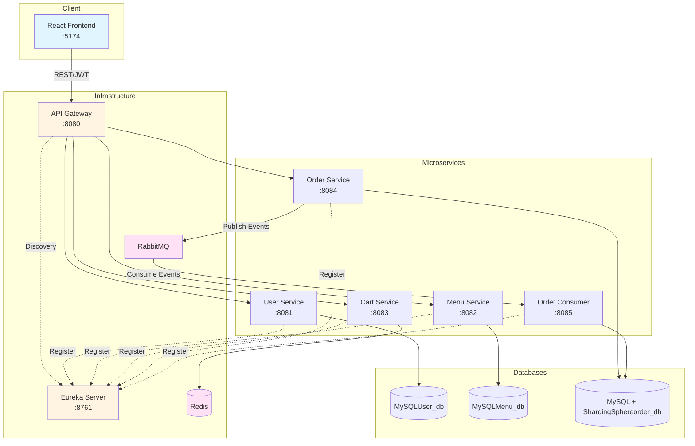
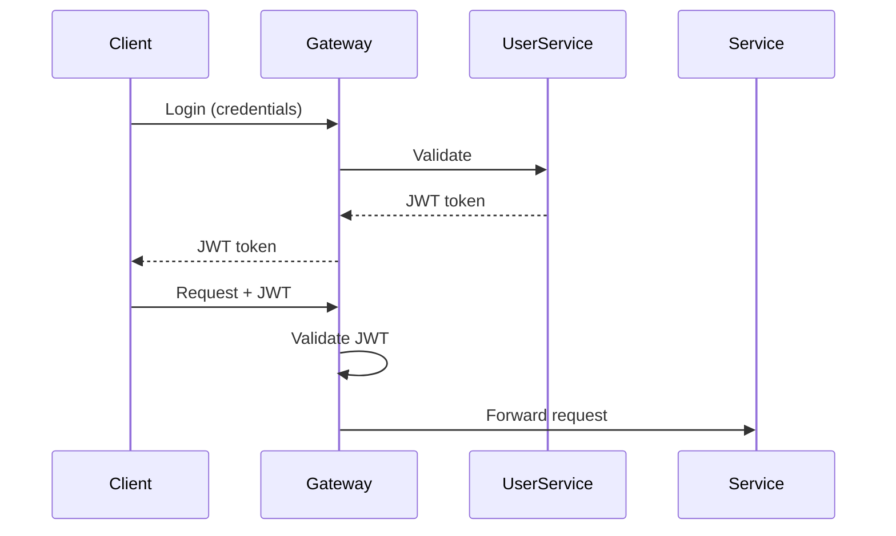
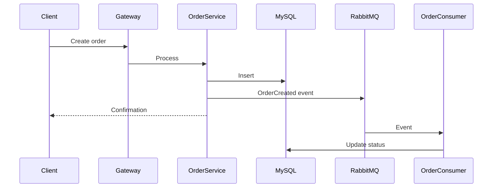

# System Architecture

This document describes the high-level architecture of the **Online Ordering System**. Detailed API definitions, sharding strategy, and messaging design are documented separately.

---

## 1. Architecture Overview

Microservice-based architecture using **Spring Cloud** and **React**, with JWT authentication and event-driven communication.

---

## 2. System Components

| Component          | Port | Responsibility                                      |
|--------------------|------|-----------------------------------------------------|
| **React Frontend** | 5174 | Role-based UI (Customer/Vendor/Admin)               |
| **API Gateway**    | 8080 | Routing, JWT validation                             |
| **Eureka Server**  | 8761 | Service discovery and registration                  |
| **User Service**   | 8081 | Authentication, user management (MySQL)             |
| **Menu Service**   | 8082 | Menu and product catalog (MySQL)                    |
| **Cart Service**   | 8083 | Shopping cart management (Redis)                    |
| **Order Service**  | 8084 | Order creation and queries (MySQL + ShardingSphere) |
| **Order Consumer** | 8085 | Async order processing (MySQL + ShardingSphere)     |
| **RabbitMQ**       | -    | Event-driven messaging                              |
| **Redis**          | -    | Caching and cart storage                            |

---

## 3. Core Data Flows

### 3.1 Authentication Flow

### 3.2 Order Processing Flow

---

## 4. Communication Patterns

- **Client ↔ Backend**: REST via API Gateway
- **Service Discovery**: Eureka-based registration
- **Sync**: REST 
- **Async**: RabbitMQ events

---

## 5. Design Highlights

- **Scalability**: Stateless services, horizontal scaling
- **Security**: JWT authentication, role-based authorization
- **Performance**: Redis caching, async processing, database sharding
- **Isolation**: Independent services, no shared databases

---

## 6. Related Documents

- [`README.md`](README.md) – Project overview
- [`API_DOCUMENTATION.md`](backend/docs/api/API_DOCUMENTATION.md) – API definitions
- [`MYSQL_SHARDING.md`](backend/docs/database/MYSQL_SHARDING.md) – Database sharding
- [`REDIS.md`](backend/docs/database/REDIS.md) – Database sharding
- [`RABBITMQ.md`](backend/docs/messaging/RABBITMQ.md) – Messaging design